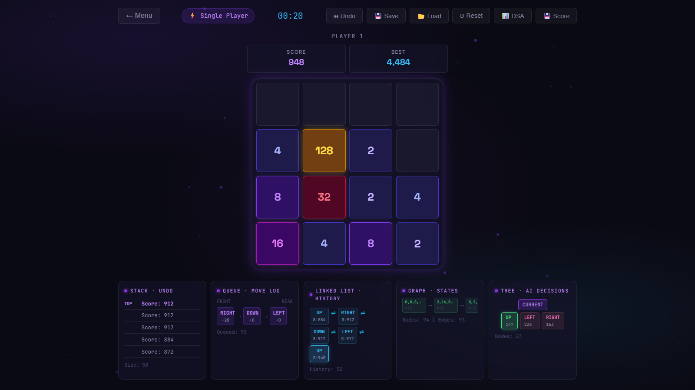
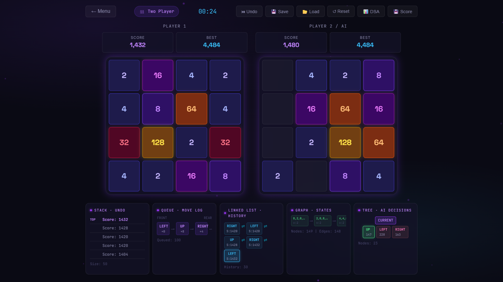
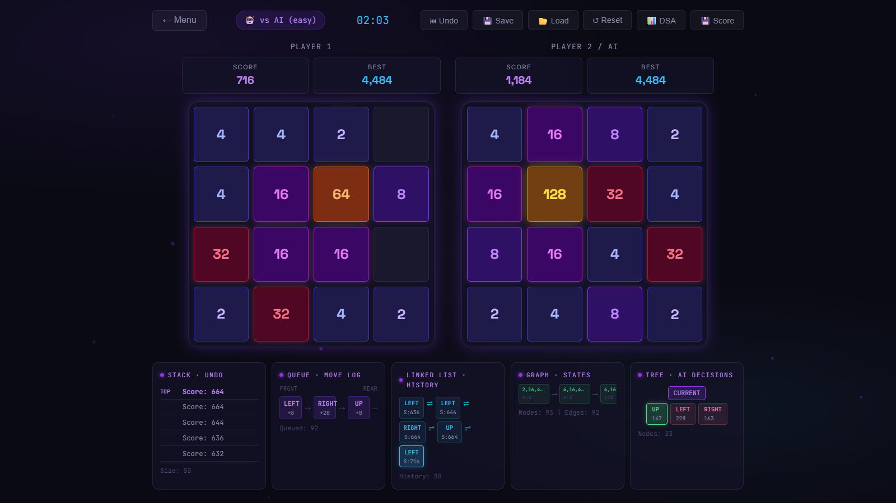
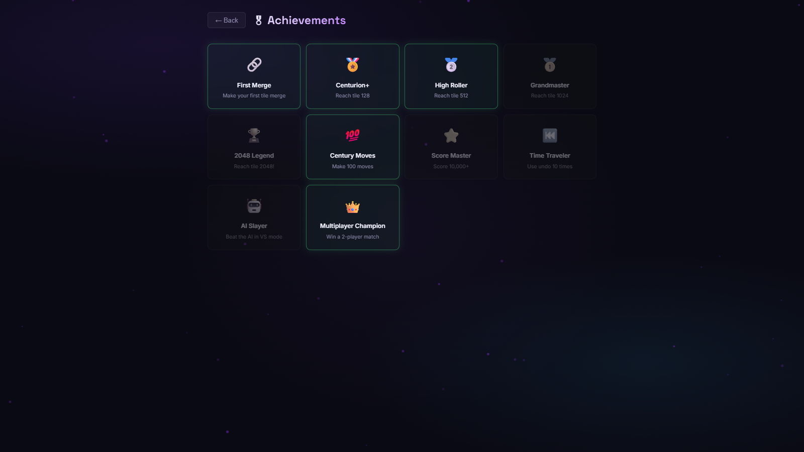
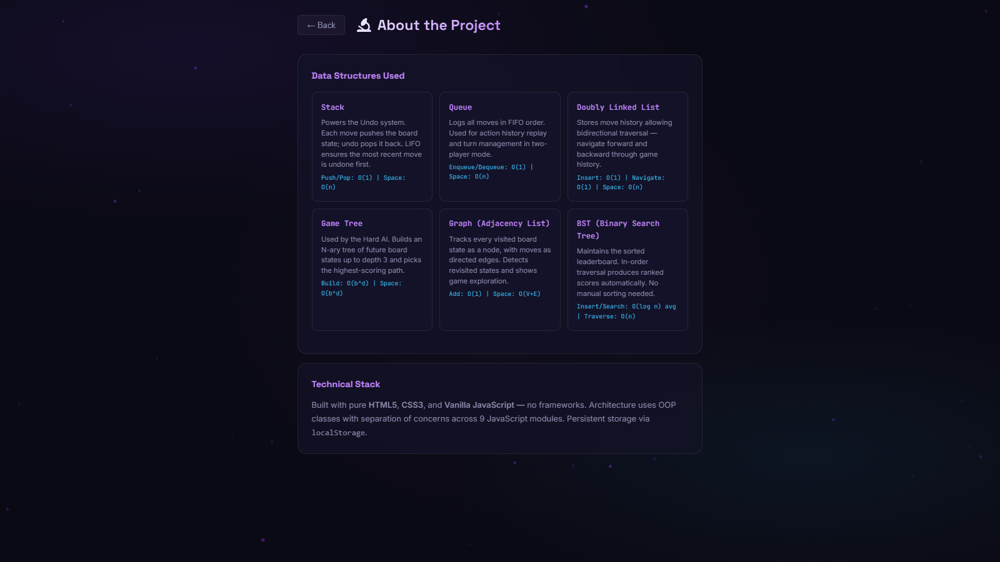
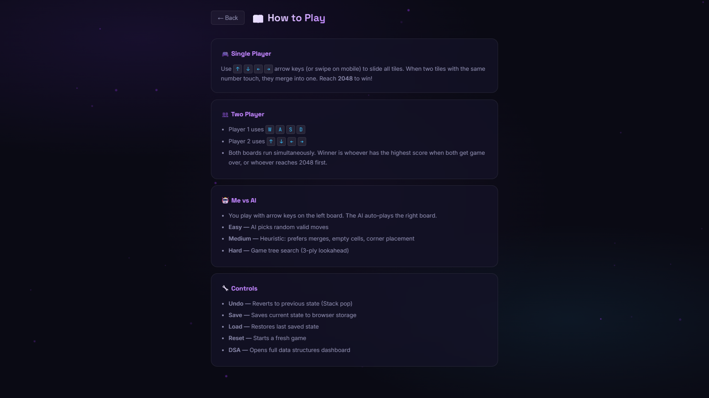

<div align="center">

# 🎮 2048 — Data Structures Edition

**The classic 2048 game — reimagined with an AI opponent, 2-player mode, achievements, and a live data structures visualizer.**

[](https://developer.mozilla.org/en-US/docs/Web/HTML)
[](https://developer.mozilla.org/en-US/docs/Web/CSS)
[](https://developer.mozilla.org/en-US/docs/Web/JavaScript)
[](https://isocpp.org/)
[](https://python.org/)

*A CS coursework project by **Syed Turab Rizvi** created in a group with teamleader being a**friend***

</div>

---

## 🌟 Overview

This isn't your average 2048 clone. Built as a computer science coursework project, it layers a full feature set on top of the classic sliding tile game — including an **AI that plays against you**, a **2-player competitive mode**, an **achievements system**, and a dedicated page that **visualizes every data structure** powering the game under the hood.

The front-end is built with HTML, CSS, and JavaScript. The algorithmic back-end implements **7 data structures from scratch** in JavaScript, with a parallel C++ version alongside it.

---

## 🕹️ Game Modes

| Mode | Description |
|---|---|
| 🧍 Single Player | Classic 2048 — slide tiles, merge numbers, reach 2048 |
| 👥 2 Player | Two boards side by side — race to the highest score |
| 🤖 VS AI | Play against an AI solver that calculates the optimal move |

---

## 📸 Screenshots

### 🧍 Single Player


---

### 👥 2 Player Mode


---

### 🤖 VS AI


---

### 🏆 Achievements


---

### 🧠 Data Structures Used


---

### 📖 How to Play


---

## 🧠 Data Structures Used

Every data structure is implemented **from scratch** in JavaScript — no built-in shortcuts. A dedicated in-game page visualizes each one and explains how it contributes to the game.

| Data Structure | File | Role in the Game |
|---|---|---|
| 🔗 Linked List | `linkedlist.js` | Tile chain traversal and merge sequencing |
| 📚 Stack | `stack.js` | Undo/redo move history |
| 🔁 Queue | `queue.js` | Move processing and animation queuing |
| 🌳 Tree | `tree.js` | Game state hierarchy |
| 🌲 Binary Search Tree | `bst.js` | Efficient score/tile lookup and ordering |
| 🕸️ Graph | `graph.js` | Board connectivity and BFS/DFS traversal for AI |

> Each structure is fully custom — built without JavaScript's native Map, Set, or similar abstractions.

---

## 🤖 AI Solver

The `ai.js` module powers the AI opponent in VS AI mode.

| Property | Detail |
|---|---|
| **Algorithm** | Graph-based BFS/DFS traversal of possible board states |
| **Decision basis** | Evaluates available moves and picks the optimal tile merge path |
| **Runs on** | Same pipeline as the player — uses the same game engine |
| **Speed** | Real-time move calculation per turn |

The AI processes the board as a **graph**, evaluating connected tiles and reachable merge paths to determine the highest-value move at each step.

---

## 🏆 Achievements System

The game tracks your progress and unlocks achievements as you play.

| Achievement | Condition |
|---|---|
| 🥇 First Merge | Merge two tiles for the first time |
| 🔢 Reach 256 | Get a tile to 256 |
| 🔢 Reach 512 | Get a tile to 512 |
| 🎯 Reach 1024 | Get a tile to 1024 |
| 🏆 Reach 2048 | Beat the game |
| ⚔️ Beat the AI | Win a round in VS AI mode |
| 👥 2-Player Win | Win a 2-player match |

---

## 🛠️ Tech Stack

| Technology | Role |
|---|---|
| **HTML5** | Game structure and page layout |
| **CSS3** | Tile styling, color gradients, dark theme UI, animations |
| **JavaScript** | Game logic, AI solver, all data structure implementations |
| **C++** | Parallel back-end implementation of the same game logic |
| **Python** | Report generation (`report.py`) |

---

## 📁 Project Structure

```
2048-Game/
│
├── HTML/
│   └── index.html               # Main entry point
│
├── CSS/
│   └── style.css                # Global dark-theme stylesheet
│
├── JS/
│   ├── app.js                   # Entry point — wires UI to game engine
│   ├── game.js                  # Core game logic (tile merging, board state)
│   ├── ai.js                    # AI solver (graph-based move evaluation)
│   ├── linkedlist.js            # Custom linked list implementation
│   ├── stack.js                 # Custom stack (undo/redo)
│   ├── queue.js                 # Custom queue (move processing)
│   ├── tree.js                  # Custom tree
│   ├── bst.js                   # Custom binary search tree
│   └── graph.js                 # Custom graph (BFS/DFS for AI)
│
├── CPP/
│   └── main.cpp                 # C++ version of the game logic
│
└── report.py                    # Project report generator
```

---

## 🎮 How to Play

1. Use **arrow keys** to slide all tiles in a direction
2. Tiles with the **same number merge** when they collide
3. Each merge **doubles the tile value**
4. Reach the **2048 tile** to win
5. The game ends when **no moves remain**

| Key | Action |
|---|---|
| `↑` | Slide tiles up |
| `↓` | Slide tiles down |
| `←` | Slide tiles left |
| `→` | Slide tiles right |

> In **2-Player mode**, Player 1 uses arrow keys and Player 2 uses WASD.

---

<div align="center">

*2048 — now with an AI that actually tries to beat you.*

</div>
